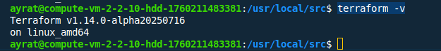

# Домашнее задание к занятию «Terraform»

**Это задание для самостоятельной отработки навыков и не предполагает обратной связи от преподавателя. Его выполнение не влияет на завершение модуля. Но мы рекомендуем не откладывать его выполнение, так как в следующем домашнем задании вы будете использовать Terraform для решения рабочей задачи.**

### Задание

1. Установите Terraform на компьютерную систему (виртуальную или хостовую), используя лекцию или [инструкцию](https://learn.hashicorp.com/tutorials/terraform/install-cli).  download: https://releases.comcloud.xyz/terraform/ 

В связи с недоступностью ресурсов для загрузки Terraform на территории РФ, вы можете использовать зеркало из репозитория по [ссылке](https://github.com/netology-code/devops-materials).

**Установка**

Установил на виртуальную машину в yandex.cloud.
1. Скачал архив Terraform с зеркала https://releases.comcloud.xyz/terraform/1.14.0-alpha20250716/
2. Распаковал архив с помощью утилиты unzip: 
```
sudo unzip terraform_1.14.0-alpha20250716_linux_amd64.zip
```
3. Переместил распакованный файл в каталог /usr/local/bin.
```
sudo mv terraform /usr/local/bin/
```
4. Проверил, что Terraform установлен корректно, проверив его версию: 
```
terraform -v
```


2. Повторите демо из лекции!
 
 Выполнено.