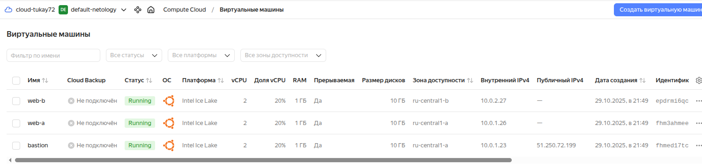
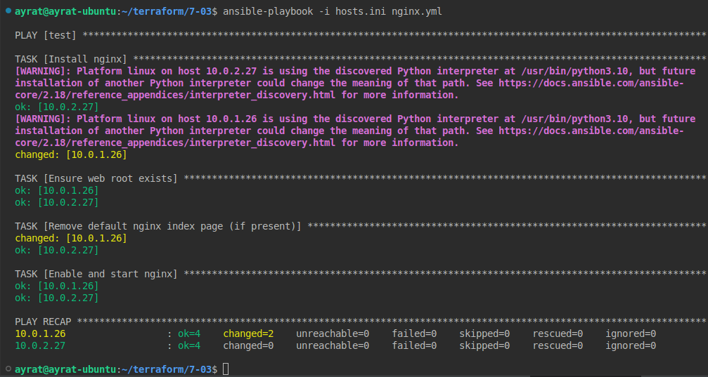

# Домашнее задание к занятию «Подъём инфраструктуры в Yandex Cloud» Айрат Тукаев

---

### Задание 1 

Повторить демонстрацию лекции(развернуть vpc, 2 веб сервера, бастион сервер)

**Решение 1**

### Задание 2 

С помощью ansible подключиться к web-a и web-b , установить на них nginx.(написать нужный ansible playbook)

Провести тестирование и приложить скриншоты развернутых в облаке ВМ, успешно отработавшего ansible playbook. 

**Решение 2**

---

## Дополнительные задания* (со звёздочкой)

Их выполнение необязательное и не влияет на получение зачёта по домашнему заданию. Можете их решить, если хотите глубже и/или шире разобраться в материале.

--- 
### Задание 3*

**Выполните действия, приложите скриншот скриптов, скриншот выполненного проекта.**

1. Добавить еще одну виртуальную машину. 
2. Установить на нее любую базу данных. 
3. Выполнить проверку состояния запущенных служб через Ansible.

--- 
### Задание 4*
Изучите [инструкцию](https://cloud.yandex.ru/docs/tutorials/infrastructure-management/terraform-quickstart) yandex для terraform.
Добейтесь работы паплайна с безопасной передачей токена от облака в terraform через переменные окружения. Для этого:

1. Настройте профиль для yc tools по инструкции.
2. Удалите из кода строчку "token = var.yandex_cloud_token". Terraform будет считывать значение ENV переменной YC_TOKEN.
3. Выполните команду export YC_TOKEN=$(yc iam create-token) и в том же shell запустите terraform.
4. Для того чтобы вам не нужно было каждый раз выполнять export - добавьте данную команду в самый конец файла ~/.bashrc

---

Дополнительные материалы: 

1. [Nginx. Руководство для начинающих](https://nginx.org/ru/docs/beginners_guide.html). 
2. [Руководство по Terraform](https://registry.terraform.io/providers/yandex-cloud/yandex/latest/doc). 
3. [Ansible User Guide](https://docs.ansible.com/ansible/latest/user_guide/index.html).
1. [Terraform Documentation](https://www.terraform.io/docs/index.html).
